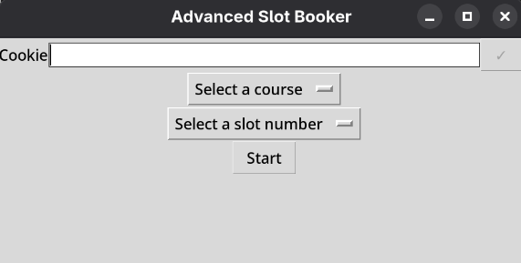

# Advanced Slot Booker
An automatic PS slot booker written in python, with a GUI  

## Preview


## Install
### Linux
```
git clone https://github.com/nishanthgit3/AdvancedSlotBooker
cd AdvancedSlotBooker
python3 -m venv .venv
source .venv/bin/activate
pip install -r requirements.txt
python3 main.py
```
> Dependencies: Install tkinter package for your respective distro, before running the commands
### Windows
[Download](https://github.com/nishanthgit3/AdvancedSlotBooker/releases/download/v1/AdvancedSlotBooker)
> Warning: Windows executable not supported, but provided. Ideally run the script directly with dependencies

## Run
### Linux
```
source .venv/bin/activate
python3 main.py
```

> Note: No AI was used in the development of this project